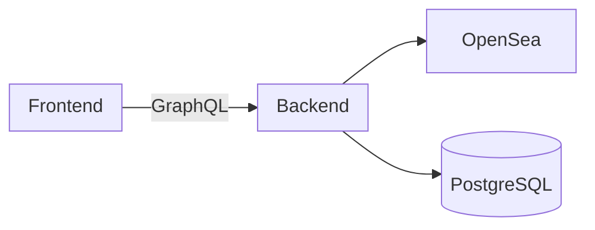

# NFT Store

## Project Overview

Welcome to the NFT Store Web Application! This fullstack project allows users to browse NFTs from OpenSea, add them to a cart, and persist their selections across sessions.


## Features

- 🖼️ Display NFT cards fetched from OpenSea API
- 🛒 Add/remove NFTs to/from a shopping cart
- 💾 Persistent cart state across sessions
- 📱 Responsive design for various screen sizes
- 🚀 Optimized for performance

## Tech Stack

### Frontend

- Next.js with TypeScript
- Tailwind CSS & HeadlessUI
- Apollo Client & React Query
- GraphQL Codegen

### Backend

- NestJS with Fastify
- GraphQL API
- TypeORM with PostgreSQL

## Architecture



## Installation

This project uses a DevContainer for the development environment.

1. Clone the repository:

   ```bash
   git clone https://github.com/your-username/nft-shopping-cart.git
   cd nft-shopping-cart
   ```

2. Install dependencies:

   ```bash
   npm install
   ```

3. Set up the database:

   - Create a PostgreSQL database

4. Set up environment variables:

   - Create `.env` files in `apps/nft-store-backend` and `apps/nft-store-frontend`
   - Use `.env.example` files as templates

5. Start development servers:

   ```bash
   # Backend
   cd apps/nft-store-backend
   npm run start:dev

   # Frontend (new terminal)
   cd apps/nft-store-frontend
   npm run dev
   ```

6. Open `http://localhost:3000` in your browser

## Usage Guide

1. Browse NFT cards on the main page
2. Click on an NFT to add it to your cart
3. Access your cart via the cart icon
4. Remove items from the cart as needed
5. Your cart persists across browser sessions

## Configuration

Key configuration options:

- `DATABASE_URL`: PostgreSQL connection string (backend)
- `OPENSEA_API_KEY`: Your OpenSea API key (backend)
- `NEXT_PUBLIC_API_URL`: GraphQL API endpoint (frontend)

Refer to `.env.example` files for all available options.

## Testing

Run tests with:

```bash
# Backend
cd apps/nft-store-backend
npm test

# Frontend
cd apps/nft-store-frontend
npm test
```
