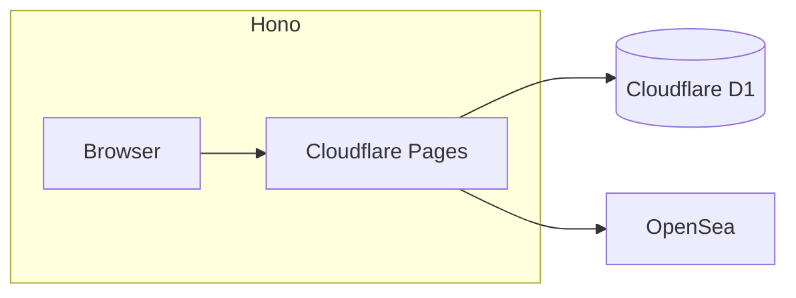

# NFT Store

## Project Overview

Welcome to the NFT Store Web Application! This fullstack project allows users to browse NFTs from OpenSea, add them to a cart, and persist their selections across sessions.


## Features

- 🖼️ Display NFT cards fetched from OpenSea API
- 🛒 Add/remove NFTs to/from a shopping cart
- 💾 Persistent cart state across sessions
- 📱 Responsive design for various screen sizes
- 🚀 Optimized for performance

## Tech Stack

### Isomorphic Application

- Hono & HonoX
- Tailwind CSS & HeadlessUI

## Architecture



## Installation

This project uses a DevContainer for the development environment.

1. Clone the repository:

   ```sh
   git clone https://github.com/jakelee8/nft-store.git
   cd nft-store
   ```

2. Install dependencies:

   ```sh
   npm install
   ```

3. Set up environment variables:

   - Create a `.dev.vars` file
   - Use `.dev.vars.example` files as a template

4. Apply the Cloudflare D1 database schema:

   ```sh
   npx wrangler d1 execute nft-store --local --file migrations/0000_initial.sql
   ```

5. Start the development server:

   ```sh
   npm run dev
   ```

6. Open `http://localhost:3000` in your browser

## Usage Guide

1. Browse NFT cards on the main page
2. Click on an NFT to add it to your cart
3. Access your cart via the cart icon
4. Remove items from the cart as needed
5. Your cart persists across browser sessions

## Configuration

Key configuration options:

- `OPENSEA_API_KEY`: Your OpenSea API key (backend)

Refer to `.dev.vars.example` files for all available options.

## Testing

Run tests with:

```bash
npm test
```
